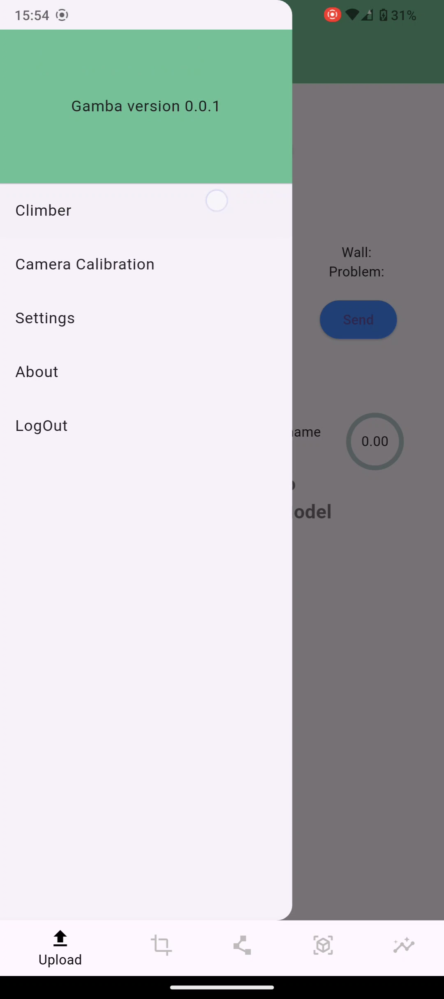

# 3D Climbing Analysis Tool

An App to provide insight for your attempts by innovative ("Kakushin" "革新") analysis to assist you to overcome the core ("Kakushin" "核心") of the problem.

1. Monocular video to 3D animation

2. Physical quantities analysis

3. Compare with others

This is created based on ideas shown in https://github.com/jipparchus/Gamba.

**Screenshots**

  
  
  
  
  

