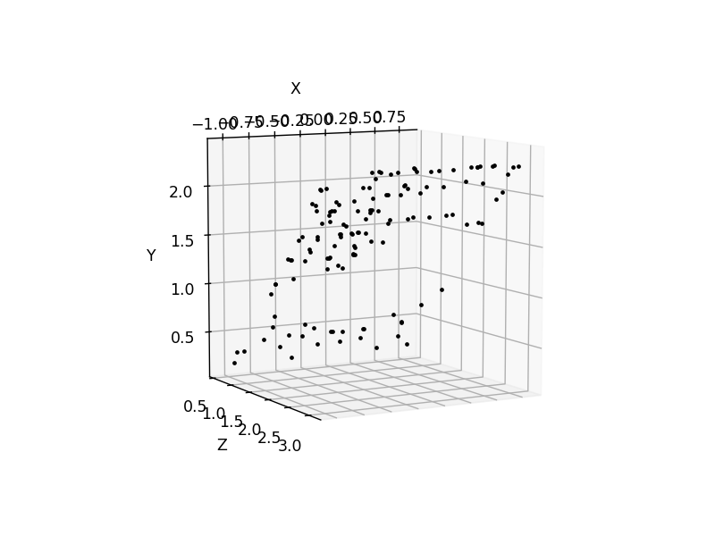
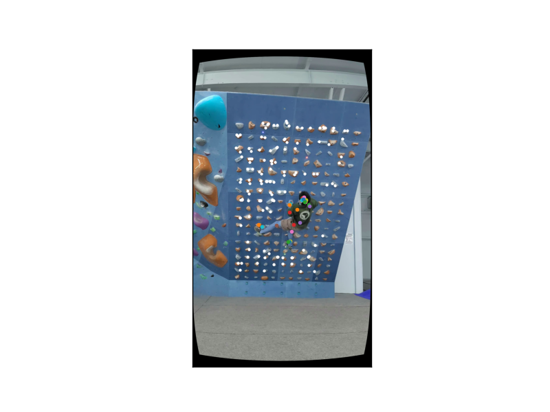
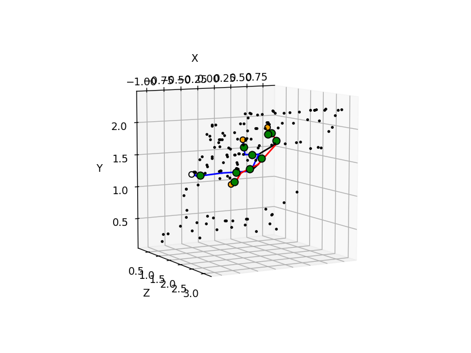
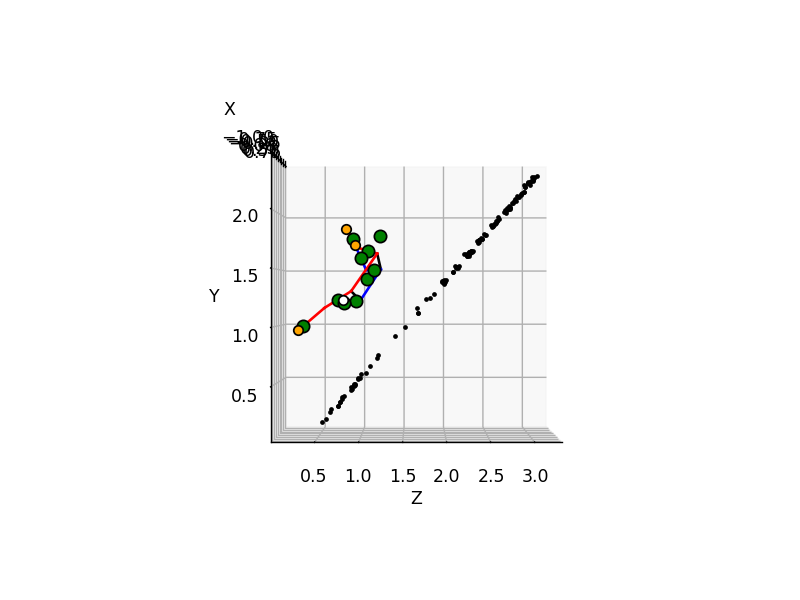
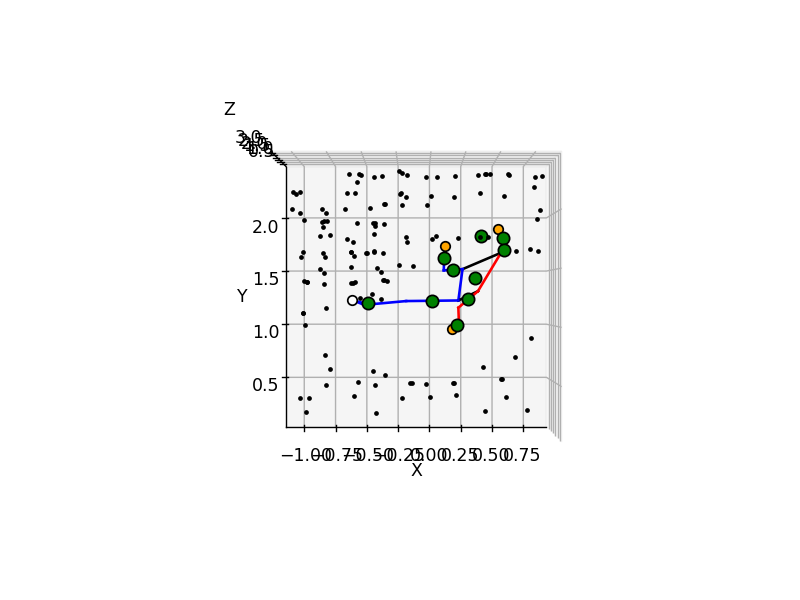
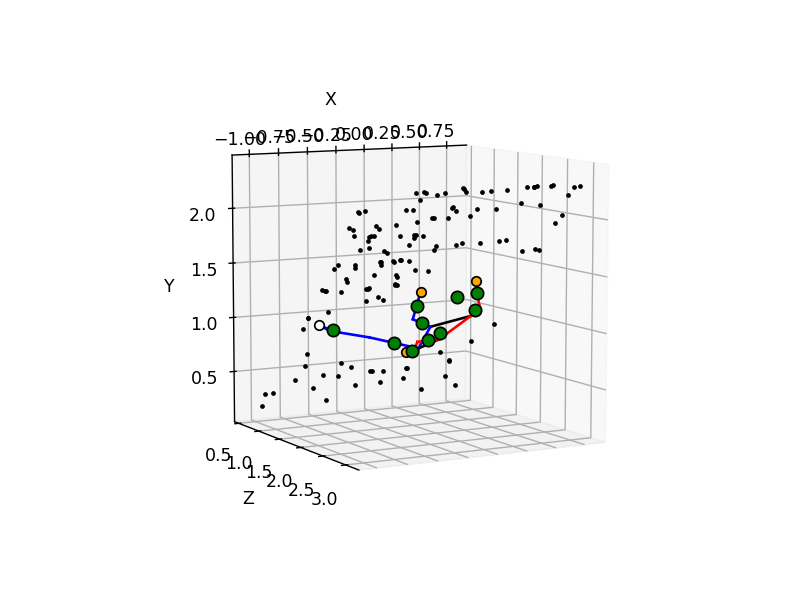
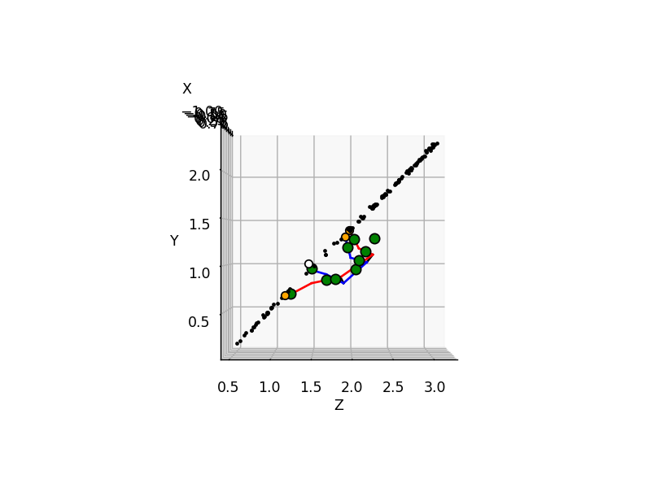
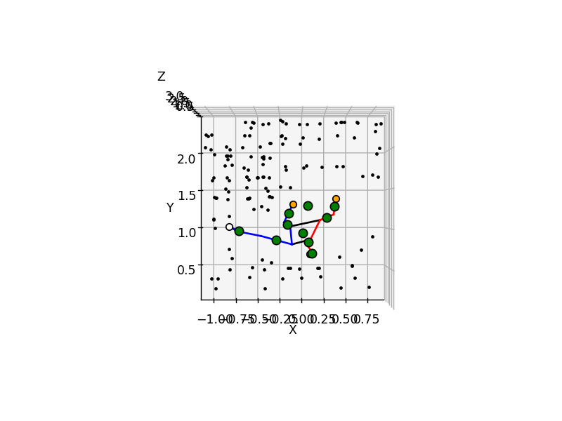

# 3D Climbing Analysis Tool

An App to provide insight for your attempts by innovative ("Kakushin" "革新") analysis to assist you to overcome the core ("Kakushin" "核心") of the problem.

1. Monocular video to 3D animation

2. Physical quantities analysis

3. Compare with others

This is created based on ideas shown in https://github.com/jipparchus/Gamba.

## UI Screenshots (under development)

  
  
  
  
  

## Concept Testing

Condition:
- A 3D mesh model of Moonboard is created using smartphone
- Rendering perspective is approximately alighned with that of the video frames
- Contact of hands/feet is recorded manually using the annotation tool in https://github.com/jipparchus/Gamba.

Future Plan:
- [ ] Stabilise the pose by controlling the pose coordinates adjustment based on the confidence scores of the pose detection
- [ ] Multi-threading to speed up creation of the animation.
- [ ] Physical quantities analysis
- [ ] Impremenation of the frontend
- [ ] Analysing the pose coordinates over frames and smooth the moves, exclude non-physical motions.
- [ ] Optimised rendering perspective estimation.
- [ ] Getting rendering perspective to video frame perspective transformation matrix
- [ ] Train an AI model to automate climber-wall contact state detection

**1. Feature Point Matching**

Aim: Finding pairs of points between the rendered wall image and the video frame. The coordinates $P_{render}$ and $P_{video}$ are both 2D.

  

**2. Feature Points 3D Coordinates Estimation by 3D Model**

Aim: Finding the 3D coordinates of the feature points $P_{model}$ on the 3D mesh model of the wall.

  

**3. Feature Points Human Pose 3D Coordinates Projection**

Aim: Finding transformation matrix $T_{wall}$  3D feature points coordinates $P_{model}$ to 2D feature points coordinates $P_{video}$ as $P_{video}=T_{wall} P_{model}$. At the same time, human pose 3D coords to 2D coords transformation matrix is computed as $T_{pose}$.

White points are the projection of $P_{model}$ calculated using $T_{wall}$. The colourful points are the 3D pose coordinates projected on the video frame using $T_{pose}$.

  

**4. 3D Plot without Adjustment**

Aim: Check the reliability of the transformation matrices by plotting the $P_{model}$ and 3D human pose in the same 3D cartesian frame. The human pose is transformed as $T_{wall}^{-1} T_{pose} P_{pose}$ to match the coordinate system with that of $P_{model}$.

  
  
  

**5. Contact Points Adjustment**

Aim: To adjust the human pose coordinates so that it looks realistic. Using the previously made tool (https://github.com/jipparchus/Gamba), the contact points of the climber are recorded and the $P_{video}$ to $P_{render}$ transformation with raycasting method used in **Step 2** let us calculate the adjusted 3D pose.

  
  
  

