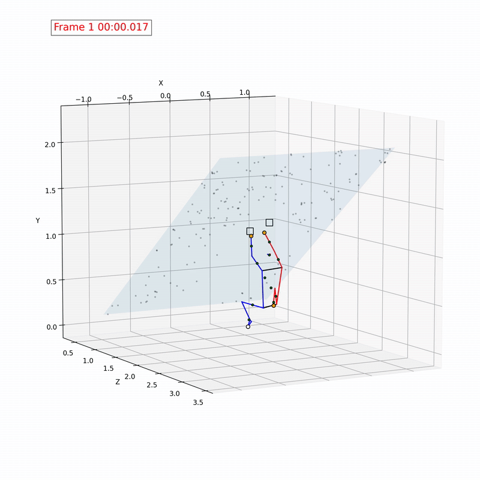

# 3D Climbing Analysis Tool

An App to provide insight for your attempts by innovative ("Kakushin" "革新") analysis to assist you to overcome the core ("Kakushin" "核心") of the problem.

1. Monocular video to 3D animation

2. Physical quantities analysis

3. Compare with others

This is created based on ideas shown in https://github.com/jipparchus/Gamba.

## UI Screenshots (under development)

  
  
  
  
  

## Concept Testing

### 3D Animations

  
  
  

### Physical Quantities

  
  
  
  
  
  

(Top) body parts coordinates, velocity, linear momentum. (Bottom) impulse, angular velocity, angular momentum.

**Conditions**:
- A 3D mesh model of Moonboard is created using smartphone app (RealityScan)
  

  

- Rendering perspective is approximately alighned with that of the video frames
- Contact of hands/feet is recorded manually using the annotation tool in https://github.com/jipparchus/Gamba.

**Future Plan**:
- [ ] Stabilise the human pose through the frames.
- [ ] Multi-threading to speed up analysis and animation creation. (It takes ~15 min now)
- [ ] Visualisation of angular momentum in 3D plots
- [ ] Impremenation of the frontend
- [ ] Analysing the pose coordinates over frames and smooth the moves, exclude non-physical motions.
- [ ] Optimised rendering perspective estimation.
- [ ] Getting rendering perspective to video frame perspective transformation matrix
- [ ] Train an AI model to automate climber-wall contact state detection

  

    
  

**1. Feature Point Matching**

Aim: Finding pairs of points between the rendered wall image and the video frame. The coordinates $P_{render}$ and $P_{video}$ are both 2D.

  

**2. Feature Points 3D Coordinates Estimation by 3D Model**

Aim: Finding the 3D coordinates of the feature points $P_{model}$ on the 3D mesh model of the wall.

  

**3. Feature Points Human Pose 3D Coordinates Projection**

Aim: Finding transformation matrix $T_{wall}$  3D feature points coordinates $P_{model}$ to 2D feature points coordinates $P_{video}$ as $P_{video}=T_{wall} P_{model}$. At the same time, human pose 3D coords to 2D coords transformation matrix is computed as $T_{pose}$.

White points are the projection of $P_{model}$ calculated using $T_{wall}$. The colourful points are the 3D pose coordinates projected on the video frame using $T_{pose}$.

  

**4. 3D Plot without Adjustment**

Aim: Check the reliability of the transformation matrices by plotting the $P_{model}$ and 3D human pose in the same 3D cartesian frame. The human pose is transformed as $T_{wall}^{-1} T_{pose} P_{pose}$ to match the coordinate system with that of $P_{model}$.

  
  
  

**5. Contact Points Adjustment**

Aim: To adjust the human pose coordinates so that it looks realistic. Using the previously made tool (https://github.com/jipparchus/Gamba), the contact points of the climber are recorded. Poses were re-computed taking minimising ...

1. the differences between the ideal and detected contact points coordinates
2. the differences of projection of the re-computed 3D coordinates from the original video perspective and the 2D pose detected in the video
3. the non-physical situation (i.e. any part of the body should not penetrate the wall)

As a result, I get some better 3D poses, but still there are funny poses.

  
  
  

*(https://youtu.be/7uWb7XOdLeM?si=7Y_7BfOQx9DI-j4g)*

**6. Pose Smoothing**

Aim: Smoothing the poses in time to eliminate the wiggling behaviour. After removing the coordinates data whose detection confidence < 20%, the missing data is interpolated linearly. Subcequently, a Savitzky-Golay filter is applied to smooth the coordinates over the time.

  
  
  

As a side effect, the consistency of the body part lengths are broken. Need a further adjustment, and I have a few ideas for that...

**7. Physical Quantities**

- Velocity ($\vec{v}$): The first derivative of the displacement.
- Linear Momentum ($\vec{p}$): Mass times velocity of each part of he body.
- Impulse ($\Delta \vec{p}$): Change of the linear momentum. It is also a product of the timestep ($\Delta t$) and the average net force ($\bar{F}$).
- Angular Velocity ($\vec{\omega}$): Speed of rotation around an axis. Computed for left and right thigh, shank, upper & lower arm around the keypoints of the pose connected i.e. waist, knee, shoulder, and elbow.
- Angular Momentum ($\vec{L}$): Computing $I \vec{\omega}$ for each part, where $I$ is the moment of inertia.